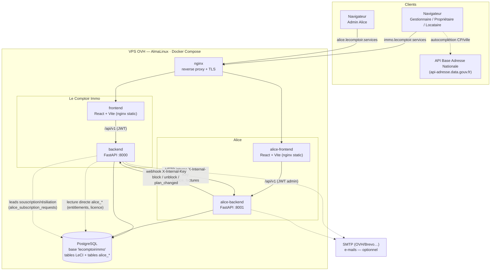
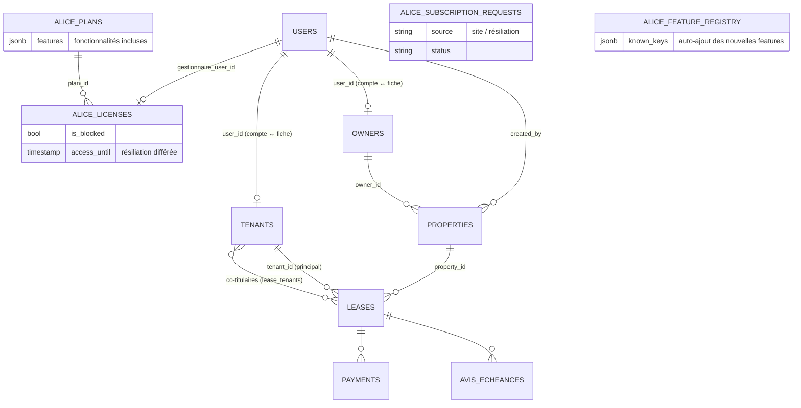
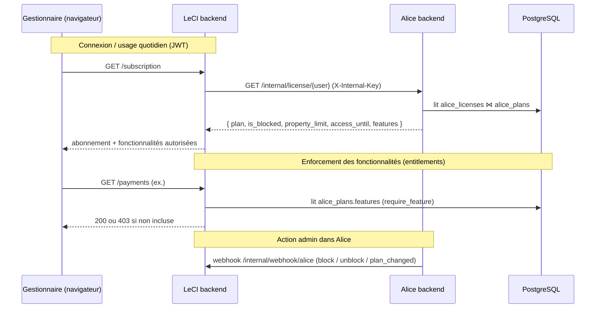
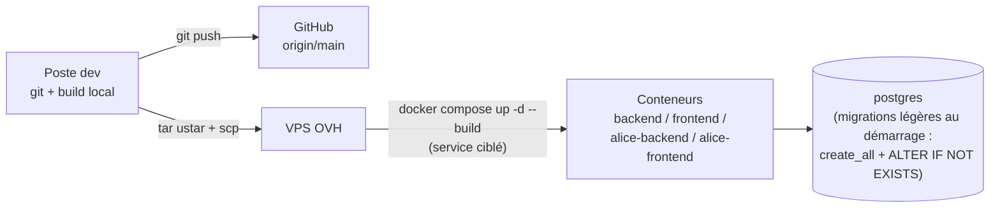

# Architecture technique — Le Comptoir Immo & Alice

Deux applications distinctes mais couplées, déployées ensemble sur un VPS OVH via
Docker Compose, derrière un reverse proxy nginx, et partageant **une seule base
PostgreSQL**.

- **Le Comptoir Immo (LeCI)** — l'application de gestion locative (gestionnaires,
  propriétaires, locataires). Domaine : `immo.lecomptoir.services`.
- **Alice** — le back-office SaaS (administration des comptes gestionnaires, plans
  tarifaires, licences, facturation, demandes). Domaine : `alice.lecomptoir.services`.

---

## 1. Vue d'ensemble (composants)



---

## 2. Stack technique

| Couche | Le Comptoir Immo | Alice |
|---|---|---|
| Frontend | React 18 + TypeScript, Vite, Tailwind, react-router-dom, react-hook-form + Zod, Zustand, Axios, lucide-react | idem (sous-ensemble) |
| Backend | FastAPI (async), SQLAlchemy 2 async, Pydantic v2, JWT (auth) | FastAPI (async), SQLAlchemy 2 async, Pydantic v2 |
| PDF | Jinja2 + xhtml2pdf (bail, attestation de loyer, tiers payant, avis, quittances) | xhtml2pdf (factures) |
| Base de données | PostgreSQL (asyncpg) — base partagée `lecomptoirimmo` | mêmes tables (préfixe `alice_*`) dans la même base |
| Conteneurs | `backend`, `frontend` | `alice-backend`, `alice-frontend` |
| Infra commune | `postgres`, `nginx`, Docker Compose, VPS OVH AlmaLinux | — |

---

## 3. Modèle de données (principales entités)



- `users` (LeCI) porte `full_name` (= **nom de la résidence**), `owner_full_name`
  (= **bailleur** sur les documents), `role`, coordonnées.
- Le **RIB du bailleur** vit sur la fiche `owners` (source unique).
- Les tables `alice_*` (plans, licences, factures, demandes, registre features)
  vivent dans la **même base** → Alice les écrit, LeCI les lit directement quand
  c'est pertinent (entitlements, contrôle de licence en repli).

---

## 4. Intégration LeCI ↔ Alice



**Mécanismes transverses clés :**

- **Authentification** : JWT (access/refresh) ; rôles `admin`, `gestionnaire`,
  `gestionnaire_proprio`, `proprietaire`, `locataire`, `lecture`. Hiérarchie de
  permissions côté backend (`require_role`).
- **Entitlements par plan** : `alice_plans.features` (liste de clés). Appliqué
  côté LeCI au **menu** (sidebar), à l'**URL** (garde de route) et à l'**API**
  (`require_feature`/`require_any_feature`). `features = null` ⇒ toutes autorisées.
- **Auto-ajout des nouvelles fonctionnalités** : catalogue backend Alice
  (`core/feature_catalog.py`) + `alice_feature_registry` ; au démarrage, toute
  nouvelle clé est propagée (cochée) aux plans existants.
- **Licence / résiliation différée** : `access_until` (fin de mois) ; blocage
  appliqué paresseusement au prochain contrôle de licence (pas de cron).
- **Souscription / résiliation** : formulaires publics LeCI → table partagée
  `alice_subscription_requests` → traités dans Alice (« Demandes »).
- **Documents PDF** : Jinja2 → xhtml2pdf (bail non meublé loi 89-462, attestation
  de loyer CERFA 10842*07, formulaire tiers payant CERFA 11362*04, avis, quittances).
- **Autocomplétion adresse** : le frontend LeCI appelle directement la Base
  Adresse Nationale (API publique, sans backend).
- **E-mails** : `email_service` (SMTP) — câblé mais désactivé tant que SMTP non
  configuré (les envois sont alors des no-op).

---

## 5. Déploiement



- **Reverse proxy** : nginx route les deux domaines vers les frontends statiques
  et proxifie `/api` vers les backends.
- **Migrations** : au démarrage des backends — `create_all` pour les nouvelles
  tables + `ALTER TABLE ... ADD COLUMN IF NOT EXISTS` (idempotent) pour les
  nouvelles colonnes. (Alembic présent pour l'historique.)
- **Env** : `backend/.env.prod` et `alice/backend/.env.prod` (clés `ALICE_URL`,
  `ALICE_INTERNAL_KEY`/`INTERNAL_API_KEY`, `LECI_URL`, `DATABASE_URL`, `SMTP_*`).
```
